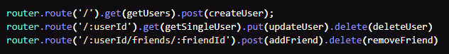
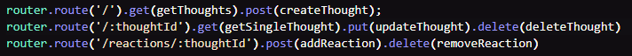
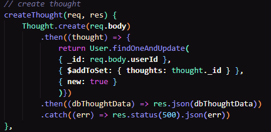

# social-network-api

## Description 

This is a backend api demonstration of a social media like application utilizing a NoSql database (in this case MongoDB) to display, manage, and store data through Insomnia. 

### [Live Demo](https://youtu.be/sQVA5Qzxxhk)

## Table of Contents

* [Installation](#installation)
* [Usage](#usage)
* [Credits](#credits)
* [License](#license)


## Installation

Clone or fork repository and run on local machine. To install necessary dependencies, run the following command: 
```npm i```

## Usage 

Run the command `npm run start` or `node index.js` to start the application.

Then on Insomnia, we have the following user routes: 



> * The first user route `/api/users` allows us to get all users or create new ones with the following JSON body: 
>`{"username": "test","email": "test@test.com"}`
> * The second user route allows us to single out a user through the "`_id`" string value to display, update, or delete the user.
>* The third route allows user to add/remove other users to the friends array in the schema and display them through the 2nd user route.

There are also the following thought routes:



> * The first thought route `/api/thoughts` allows us to get all thoughts or create new ones with the following JSON body: 
>`{"thoughtText": "test thought 1", "username": "test", "userId": "userId"}`
> * The second thought route allows us to single out a thought through the "`_id`" string value to display, update, or delete the thought. this thought is then updated and tied to the username through the userId and updated to be visible to the User schema:
>>>>
>* The last route allows for the creation of reactions (comments) that are pushed to the reactions array in the thought schema.

## Credits

[Nodejs](https://nodejs.org/dist/latest-v16.x/docs/api/)

[Express](https://www.npmjs.com/package/express)

[MongoDB](https://www.mongodb.com/)

[Mongoose](https://mongoosejs.com/)

[Insomnia](https://insomnia.rest/)

[Moment](https://momentjs.com/)

## License

 This project is licensed under the MIT license.

[](https://opensource.org/licenses/MIT)